# VS Code Pets Achievements for Copilot Chat

> A reference for the Copilot Chat pet achievements and hat accessories in VS Code.

View this reference online at [e-marchand.github.io/vscode-pets-archievements](https://e-marchand.github.io/vscode-pets-archievements/).

This list is based on the upstream `microsoft/vscode` `chatPetAchievements.ts` definitions and the matching accessory sprite sheets copied into [`assets/accessories`](./assets/accessories). Each accessory image is a 384 x 288 PNG atlas containing animation frames.

## Enabled achievements

| Achievement | Trigger / unlocked description | Hint shown while locked | Reward accessory | Sprite sheet |
| :-- | :-- | :-- | :-- | :-- |
| Second Draft | You edited and resent an earlier chat request. | An earlier request may deserve a second pass. | Grand Top Hat & Monocle | 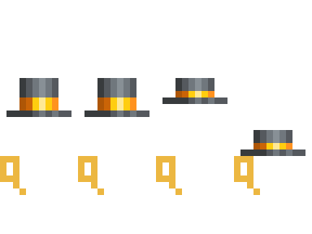 `grand-top-hat-monocle.png` |
| Welcome to the Wild West | You sent your first chat message. | Every collection starts with a first conversation. | Cowboy Hat | 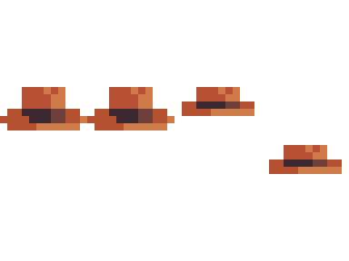 `cowboy-hat.png` |
| Shared Perspective | You shared the integrated browser with the agent. | Let the agent see what you see in the integrated browser. | Baseball Cap | 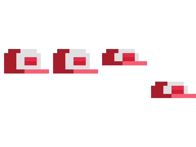 `baseball-cap.png` |
| Model Citizen | You selected a different model from the model picker. | A different model can offer a different perspective. | Construction Hard Hat | 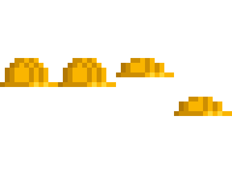 `construction-hard-hat.png` |
| Server Wrangler | You configured an MCP server. | Connect Chat to a server beyond the editor. | Firefighter Helmet | 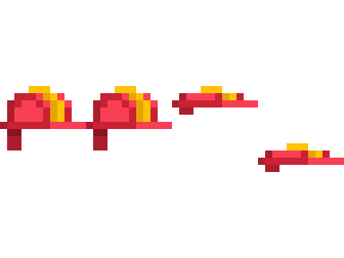 `firefighter-helmet.png` |
| Skilled Builder | You added a custom skill. | Teach Chat a skill of your own. | Crown | 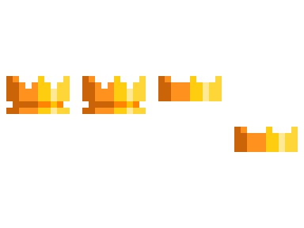 `crown.png` |
| Mission Control | You opened the Agents window. | Some agent work belongs in its own window. | Propeller Hat | 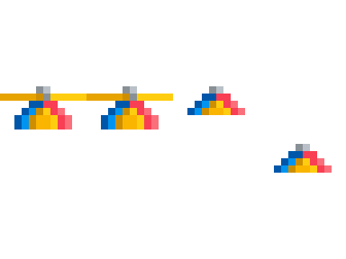 `propeller-hat.png` |
| Ship it | You used Create PR in the Agents window. | When the changes are ready, send them on their way. | Dark Sailor Hat | 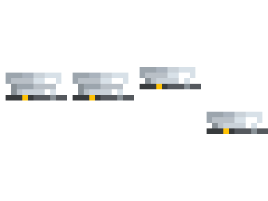 `dark-sailor-hat.png` |
| Let it cook | You kept a change prepared by Chat. | Give a good idea time to come together. | White Chef Hat | 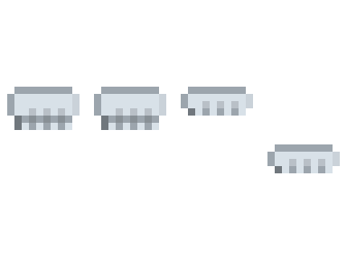 `white-chef-hat.png` |
| Trust but Verify | You opened agent changes for review. | Take a closer look before keeping the changes. | Bamboo Hat | 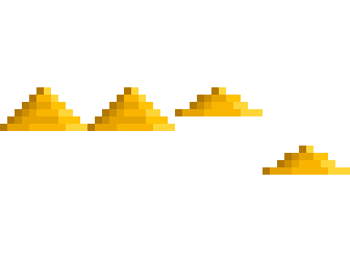 `bamboo-hat.png` |
| Follow the Trail | You opened a file or code reference from Chat. | Useful answers often point somewhere worth exploring. | Straw Hat | 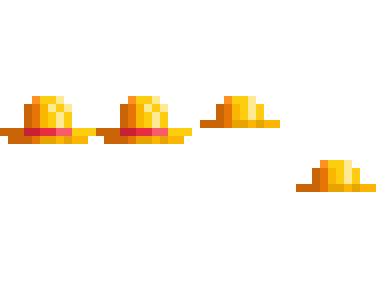 `straw-hat.png` |
| Copy That | You copied useful output from Chat. | Keep something useful from a chat response. | Pink Party Hat | 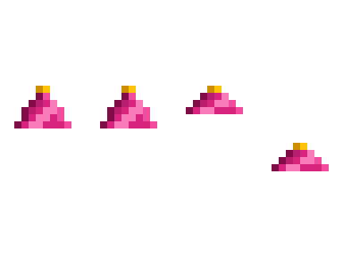 `pink-party-hat.png` |
| Party Mode | You switched an agent session from Interactive to Autopilot. | Some work is ready to carry on with less steering. | Wizard Hat | 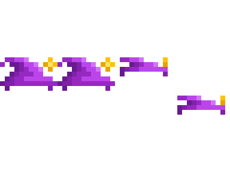 `wizard-hat.png` |

## Disabled definitions

These achievements and accessories exist in the upstream definitions, but are currently marked `enabled: false`.

| Achievement | Trigger / unlocked description | Hint shown while locked | Reward accessory | Sprite sheet |
| :-- | :-- | :-- | :-- | :-- |
| Well Instructed | You added custom instructions. | Leave Chat some standing guidance of your own. | Light Sailor Hat | 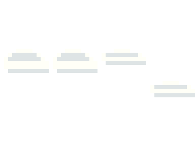 `sailor-hat.png` |
| Course Correction | You queued or steered a follow-up message while chat was working. | Try changing course before the current response finishes. | Full-Size Spinner Hat | 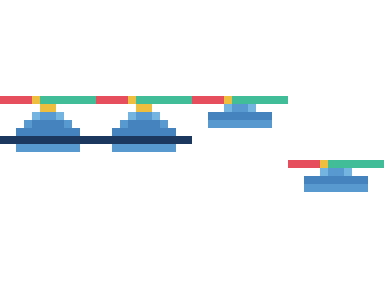 `full-size-spinner-hat.png` |
| Copy That | You copied output from chat. | Keep something useful from a chat response. | Leaning Party Hat | 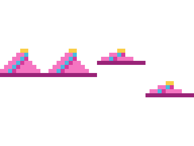 `leaning-party-hat.png` |
| Picture This | You sent a chat request with an image attached. | Show Chat something instead of only describing it. | Artist Beret | 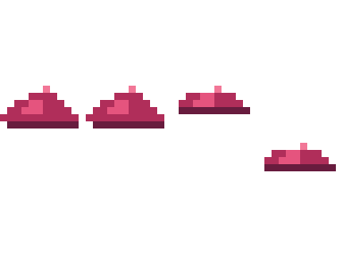 `artist-beret.png` |

## Attribution and license

The achievement names, descriptions, hints, and pet accessory artwork shown here are derived from Visual Studio Code source files in [`microsoft/vscode`](https://github.com/microsoft/vscode), including:

- `src/vs/workbench/contrib/chat/browser/chatPetAchievements.ts`
- `src/vs/workbench/contrib/chat/browser/widget/media/chatPet/accessories/*.png`
- `src/vs/workbench/contrib/chat/browser/widget/media/chatPet/buddy-idle-stable-96.png`

Copyright (c) Microsoft Corporation. All rights reserved.

Visual Studio Code source and these copied assets are licensed by Microsoft under the [MIT License](https://github.com/microsoft/vscode/blob/main/LICENSE.txt). This repository is an unofficial reference and is not affiliated with or endorsed by Microsoft.
